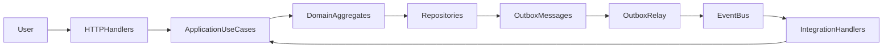

# Architecture Flow

```mermaid
flowchart LR
User[User] --> HTTP[HTTPHandlers]
HTTP --> App[ApplicationUseCases]
App --> Domain[DomainAggregates]
Domain --> Repo[Repositories]
Repo --> Outbox[OutboxMessages]
Outbox --> Relay[OutboxRelay]
Relay --> Bus[EventBus]
Bus --> Handler[IntegrationHandlers]
Handler --> App
```
