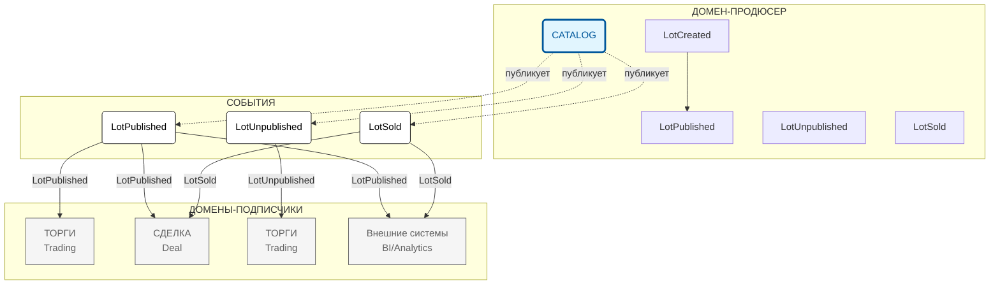

# Домен: КАТАЛОГ (Catalog)

```mermaid
flowchart TD
    %% Стили
    classDef producer fill:#e1f5fe,stroke:#01579b,stroke-width:3px,color:#01579b
    classDef consumer fill:#f5f5f5,stroke:#616161,stroke-width:1px,color:#616161
    classDef event fill:#ffffff,stroke:#000000,stroke-width:1px,color:#000000
    
    %% Продюсер
    subgraph Producer [ДОМЕН-ПРОДЮСЕР]
        direction TB
        P(CATALOG):::producer
        
        C1[LotCreated] --> C2[LotPublished]
        C3[LotUnpublished]
        C4[LotSold]
    end
    
    %% События
    subgraph Events [СОБЫТИЯ]
        E1(LotPublished):::event
        E2(LotUnpublished):::event
        E3(LotSold):::event
    end
    
    %% Консьюмеры
    subgraph Consumers [ДОМЕНЫ-ПОДПИСЧИКИ]
        direction TB
        C_T1[ТОРГИ<br>Trading]:::consumer
        C_D1[СДЕЛКА<br>Deal]:::consumer
        C_T2[ТОРГИ<br>Trading]:::consumer
        C_EXT[Внешние системы<br>BI/Analytics]:::consumer
    end
    
    %% Связи
    P -.->|публикует| E1
    P -.->|публикует| E2
    P -.->|публикует| E3
    
    E1 -->|LotPublished| C_T1
    E1 -->|LotPublished| C_D1
    E1 -->|LotPublished| C_EXT
    
    E2 -->|LotUnpublished| C_T2
    
    E3 -->|LotSold| C_D1
    E3 -->|LotSold| C_EXT
```