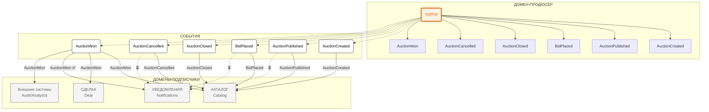

# Домен: ТОРГИ (Trading)
## Продюсер событий

```mermaid
flowchart TD
    %% Стили
    classDef producer fill:#fff3e0,stroke:#e65100,stroke-width:3px,color:#e65100
    classDef consumer fill:#f5f5f5,stroke:#616161,stroke-width:1px,color:#616161
    classDef event fill:#ffffff,stroke:#000000,stroke-width:1px,color:#000000
    
    %% Продюсер
    subgraph Producer [ДОМЕН-ПРОДЮСЕР]
        direction TB
        P(ТОРГИ):::producer
        P --> A1[AuctionCreated]
        P --> A2[AuctionPublished]
        P --> A3[BidPlaced]
        P --> A4[AuctionClosed]
        P --> A5[AuctionCancelled]
        P --> A6[AuctionWon]
    end
    
    %% События
    subgraph Events [СОБЫТИЯ]
        E1(AuctionCreated):::event
        E2(AuctionPublished):::event
        E3(BidPlaced):::event
        E4(AuctionClosed):::event
        E5(AuctionCancelled):::event
        E6(AuctionWon):::event
    end
    
    %% Консьюмеры
    subgraph Consumers [ДОМЕНЫ-ПОДПИСЧИКИ]
        direction TB
        C_CAT[КАТАЛОГ<br>Catalog]:::consumer
        C_DEAL[СДЕЛКА<br>Deal]:::consumer
        C_NOTIF[УВЕДОМЛЕНИЯ<br>Notifications]:::consumer
        C_EXT[Внешние системы<br>Audit/Analytics]:::consumer
    end
    
    %% Связи
    P -.-> E1 & E2 & E3 & E4 & E5 & E6
    
    E1 -->|AuctionCreated| C_CAT
    E2 -->|AuctionPublished| C_CAT
    E2 -.->|⏳| C_NOTIF
    E3 -->|BidPlaced| C_CAT
    E3 -.->|⏳| C_NOTIF
    E4 -->|AuctionClosed| C_CAT
    E5 -->|AuctionCancelled| C_CAT
    E5 -.->|⏳| C_NOTIF
    E6 -->|AuctionWon| C_CAT
    E6 -->|AuctionWon| C_DEAL
    E6 -->|AuctionWon ✅| C_NOTIF
    E6 -->|AuctionWon| C_EXT
```