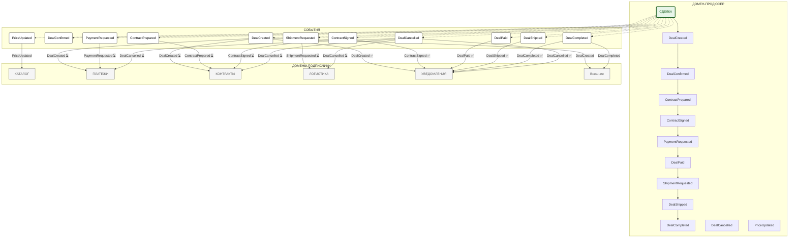

# Домен: СДЕЛКА (Deal)
## Продюсер событий

```mermaid
flowchart TD
    %% Стили
    classDef producer fill:#e8f5e9,stroke:#1b5e20,stroke-width:3px,color:#1b5e20
    classDef consumer fill:#f5f5f5,stroke:#616161,stroke-width:1px,color:#616161
    classDef event fill:#ffffff,stroke:#000000,stroke-width:1px,color:#000000
    classDef future fill:#ffecb3,stroke:#ff6f00,stroke-width:1px,color:#ff6f00,stroke-dasharray:3 3
    
    %% Продюсер
    subgraph Producer [ДОМЕН-ПРОДЮСЕР]
        direction TB
        P(СДЕЛКА):::producer
        
        P --> D1[DealCreated]
        D1 --> D2[DealConfirmed]
        D2 --> D3[ContractPrepared]
        D3 --> D4[ContractSigned]
        D4 --> D5[PaymentRequested]
        D5 --> D6[DealPaid]
        D6 --> D7[ShipmentRequested]
        D7 --> D8[DealShipped]
        D8 --> D9[DealCompleted]
        D10[DealCancelled]
        D11[PriceUpdated]
    end
    
    %% События
    subgraph Events [СОБЫТИЯ]
        E1(DealCreated):::event
        E2(DealConfirmed):::event
        E3(ContractPrepared):::event
        E4(ContractSigned):::event
        E5(PaymentRequested):::event
        E6(DealPaid):::event
        E7(ShipmentRequested):::event
        E8(DealShipped):::event
        E9(DealCompleted):::event
        E10(DealCancelled):::event
        E11(PriceUpdated):::event
    end
    
    %% Консьюмеры
    subgraph Consumers [ДОМЕНЫ-ПОДПИСЧИКИ]
        direction LR
        C_CAT[КАТАЛОГ]:::consumer
        C_PAY[ПЛАТЕЖИ]:::consumer
        C_CON[КОНТРАКТЫ]:::consumer
        C_LOG[ЛОГИСТИКА]:::consumer
        C_NOT[УВЕДОМЛЕНИЯ]:::consumer
        C_EXT[Внешние]:::consumer
    end
    
    %% Связи
    P -.-> E1 & E2 & E3 & E4 & E5 & E6 & E7 & E8 & E9 & E10 & E11
    
    E1 -->|DealCreated ⏳| C_PAY
    E1 -->|DealCreated ⏳| C_CON
    E1 -->|DealCreated ✅| C_NOT
    E1 -->|DealCreated| C_EXT
    
    E3 -->|ContractPrepared ⏳| C_CON
    E4 -->|ContractSigned ⏳| C_CON
    E4 -->|ContractSigned ✅| C_NOT
    E5 -->|PaymentRequested ⏳| C_PAY
    E6 -->|DealPaid ✅| C_NOT
    E7 -->|ShipmentRequested ⏳| C_LOG
    E8 -->|DealShipped ✅| C_NOT
    E9 -->|DealCompleted ✅| C_NOT
    E9 -->|DealCompleted| C_EXT
    E10 -->|DealCancelled ⏳| C_PAY
    E10 -->|DealCancelled ⏳| C_CON
    E10 -->|DealCancelled ⏳| C_LOG
    E10 -->|DealCancelled ✅| C_NOT
    E11 -->|PriceUpdated| C_CAT
```